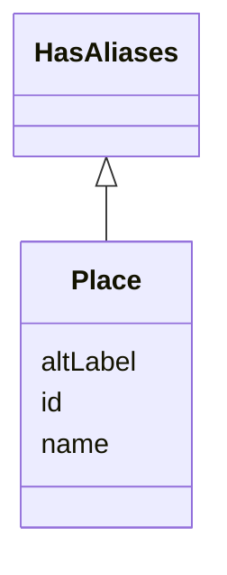

# Class: Place


URI: [ks:Place](https://w3id.org/linkml/tests/kitchen_sink/Place)





## Inheritance
* **Place** [ [HasAliases](HasAliases.md)]


## Slots

| Name | Cardinality and Range | Description | Inheritance |
| ---  | --- | --- | --- |
| [id](id.md) | 1..1 <br/> NONE | None  | direct |
| [name](name.md) | 0..1 <br/> NONE | None  | direct |
| [aliases](altLabel.md) | 0..* <br/> NONE | None  | inherited |


## Usages

| used by | used in | type | used |
| ---  | --- | --- | --- |
| [BirthEvent](BirthEvent.md) | [in location](in_location.md) | range | Place |
| [MedicalEvent](MedicalEvent.md) | [in location](in_location.md) | range | Place |
| [WithLocation](WithLocation.md) | [in location](in_location.md) | range | Place |
| [MarriageEvent](MarriageEvent.md) | [in location](in_location.md) | range | Place |


## Identifier and Mapping Information


### Schema Source


* from schema: https://w3id.org/linkml/tests/kitchen_sink


## Mappings

| Mapping Type | Mapped Value |
| ---  | ---  |
| self | ['ks:Place']|join(', ') |
| native | ['ks:Place']|join(', ') |


## LinkML Source

<!-- TODO: investigate https://stackoverflow.com/questions/37606292/how-to-create-tabbed-code-blocks-in-mkdocs-or-sphinx -->

### Direct

<details>
```yaml
name: Place
from_schema: https://w3id.org/linkml/tests/kitchen_sink
rank: 1000
mixins:
- HasAliases
slots:
- id
- name

```
</details>

### Induced

<details>
```yaml
name: Place
from_schema: https://w3id.org/linkml/tests/kitchen_sink
rank: 1000
mixins:
- HasAliases
attributes:
  id:
    name: id
    from_schema: https://w3id.org/linkml/tests/core
    rank: 1
    identifier: true
    alias: id
    owner: Place
    domain_of:
    - Person
    - Organization
    - Place
    - Concept
    - CodeSystem
    - activity
    - agent
  name:
    name: name
    from_schema: https://w3id.org/linkml/tests/core
    rank: 2
    alias: name
    owner: Place
    domain_of:
    - Friend
    - Person
    - Organization
    - Place
    - Concept
    - CodeSystem
    required: false
  aliases:
    name: aliases
    from_schema: https://w3id.org/linkml/tests/kitchen_sink
    rank: 1000
    slot_uri: skos:altLabel
    multivalued: true
    alias: aliases
    owner: Place
    domain_of:
    - HasAliases

```
</details>