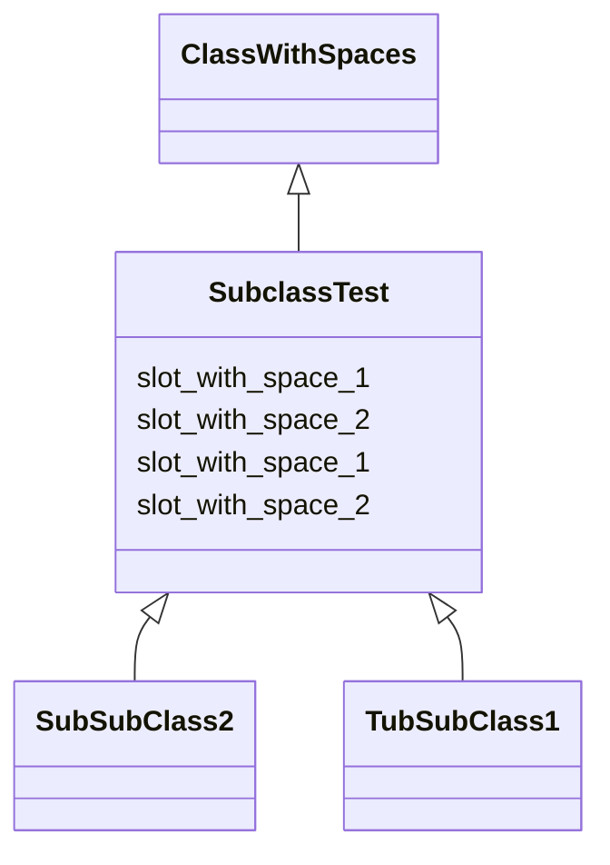

# Class: SubclassTest


URI: [ks:SubclassTest](https://w3id.org/linkml/tests/kitchen_sink/SubclassTest)





## Inheritance
* [ClassWithSpaces](ClassWithSpaces.md)
    * **subclass test**
        * [SubSubClass2](SubSubClass2.md)
        * [TubSubClass1](TubSubClass1.md)


## Slots

| Name | Cardinality and Range | Description | Inheritance |
| ---  | --- | --- | --- |
| [slot with space 2](slot_with_space_2.md) | 0..1 <br/> [ClassWithSpaces](ClassWithSpaces.md) | None  | direct |
| [slot with space 1](slot_with_space_1.md) | 0..1 <br/> NONE | None  | inherited |


## Identifier and Mapping Information


### Schema Source


* from schema: https://w3id.org/linkml/tests/kitchen_sink


## Mappings

| Mapping Type | Mapped Value |
| ---  | ---  |
| self | ['ks:SubclassTest']|join(', ') |
| native | ['ks:SubclassTest']|join(', ') |


## LinkML Source

<!-- TODO: investigate https://stackoverflow.com/questions/37606292/how-to-create-tabbed-code-blocks-in-mkdocs-or-sphinx -->

### Direct

<details>
```yaml
name: subclass test
from_schema: https://w3id.org/linkml/tests/kitchen_sink
rank: 1000
is_a: class with spaces
attributes:
  slot with space 2:
    name: slot with space 2
    from_schema: https://w3id.org/linkml/tests/kitchen_sink
    rank: 1000
    range: class with spaces

```
</details>

### Induced

<details>
```yaml
name: subclass test
from_schema: https://w3id.org/linkml/tests/kitchen_sink
rank: 1000
is_a: class with spaces
attributes:
  slot with space 2:
    name: slot with space 2
    from_schema: https://w3id.org/linkml/tests/kitchen_sink
    rank: 1000
    alias: slot_with_space_2
    owner: subclass test
    domain_of:
    - subclass test
    range: class with spaces
  slot with space 1:
    name: slot with space 1
    from_schema: https://w3id.org/linkml/tests/kitchen_sink
    rank: 1000
    alias: slot_with_space_1
    owner: subclass test
    domain_of:
    - class with spaces

```
</details>